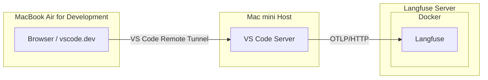
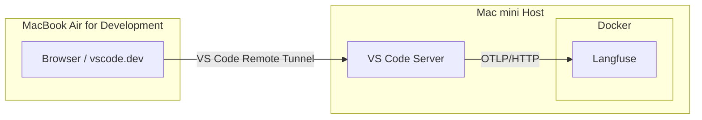

# VS Code Remote Tunnel Setup

English | [日本語](vscode-remote-tunnel.md)

This guide explains how to connect to VS Code on a Mac from a browser on a separate host using VS Code Remote Tunnel.



The sender of OpenTelemetry is not the browser, but the VS Code Server running on the remote host connected via Remote Tunnel.
Therefore, the configuration that enables connecting to the Langfuse endpoint is performed on the remote host.

In my test setup, VS Code Server and the Langfuse server reside on the same Mac mini, resulting in the following architecture:



## 1. Prerequisites

Assumes that the shared authentication environment file described in "Direct OpenTelemetry Ingestion" in the README has already been created on the remote host:

```text
~/.config/langfuse/copilot-otel.env
```

Remote Tunnel itself is assumed to have been installed as a service using the following command:

```bash
code tunnel service install --name macmini
```

For more details on VS Code Remote Tunnel, see the [official VS Code documentation](https://code.visualstudio.com/docs/remote/tunnels).

## 2. Set OpenTelemetry Environment Variables for Tunnel Service

`code tunnel service` runs under macOS `launchd`. `launchd` does not read environment variables from the terminal that installed the service or from `~/.zshrc`.

Therefore, the following settings are not reflected through the `code()` wrapper in `~/.zshrc` alone:

- `OTEL_EXPORTER_OTLP_ENDPOINT`
- `OTEL_EXPORTER_OTLP_PROTOCOL`
- `OTEL_EXPORTER_OTLP_HEADERS`
- `OTEL_RESOURCE_ATTRIBUTES`
- `OTEL_INSTRUMENTATION_GENAI_CAPTURE_MESSAGE_CONTENT`
- `COPILOT_OTEL_ENABLED`
- `COPILOT_OTEL_CAPTURE_CONTENT`

You must set the environment variables in the plist file used by the service. Below is an example script that reads values from the existing shared authentication file and applies them to the VS Code Tunnel service plist:

```bash
set -eu

ENV_FILE="$HOME/.config/langfuse/copilot-otel.env"

# First use `find` to locate the actual plist and replace this value.
PLIST="/path/to/your/tunnel.plist"

if [[ ! -r "$ENV_FILE" ]]; then
  echo "Environment file not found: $ENV_FILE" >&2
  exit 1
fi

if [[ ! -r "$PLIST" ]]; then
  echo "Tunnel service plist not found: $PLIST" >&2
  echo "First locate the plist with the following command." >&2
  echo 'find "$HOME" "$HOME/Library/LaunchAgents" -maxdepth 1 -type f -name "*.tunnel.plist" -print' >&2
  exit 1
fi

source "$ENV_FILE"

OTEL_RESOURCE_ATTRIBUTES_VALUE="langfuse.trace.metadata.execution_origin=vscode-chat"
: "${OTEL_INSTRUMENTATION_GENAI_CAPTURE_MESSAGE_CONTENT:=false}"
LABEL="$(/usr/libexec/PlistBuddy -c 'Print :Label' "$PLIST")"

launchctl unload "$PLIST" 2>/dev/null || true

if ! /usr/libexec/PlistBuddy -c 'Print :EnvironmentVariables' "$PLIST" >/dev/null 2>&1; then
  /usr/libexec/PlistBuddy -c 'Add :EnvironmentVariables dict' "$PLIST"
fi

set_plist_env() {
  local key="$1"
  local value="$2"
  plutil -remove "EnvironmentVariables.${key}" "$PLIST" 2>/dev/null || true
  plutil -insert "EnvironmentVariables.${key}" -string "$value" "$PLIST"
}

set_plist_env OTEL_EXPORTER_OTLP_ENDPOINT "$OTEL_EXPORTER_OTLP_ENDPOINT"
set_plist_env OTEL_EXPORTER_OTLP_PROTOCOL "$OTEL_EXPORTER_OTLP_PROTOCOL"
set_plist_env OTEL_EXPORTER_OTLP_HEADERS "$OTEL_EXPORTER_OTLP_HEADERS"
set_plist_env OTEL_RESOURCE_ATTRIBUTES "$OTEL_RESOURCE_ATTRIBUTES_VALUE"
set_plist_env OTEL_INSTRUMENTATION_GENAI_CAPTURE_MESSAGE_CONTENT "$OTEL_INSTRUMENTATION_GENAI_CAPTURE_MESSAGE_CONTENT"
set_plist_env COPILOT_OTEL_ENABLED "true"
set_plist_env COPILOT_OTEL_CAPTURE_CONTENT "false"

chmod 600 "$PLIST"
plutil -lint "$PLIST"

launchctl load "$PLIST"
launchctl start "$LABEL"
```

The plist path and service label can differ depending on the VS Code distribution. Locate the plist with:

```bash
find "$HOME" "$HOME/Library/LaunchAgents" -maxdepth 1 -type f -name "*.tunnel.plist" -print
```

Inspect the service label from the plist with:

```bash
/usr/libexec/PlistBuddy -c 'Print :Label' "/path/to/your/tunnel.plist"
```

Note that re-running `code tunnel service install` may regenerate the plist. In that case, re-apply the environment variable settings above.

> [!TIP]
> `OTEL_INSTRUMENTATION_GENAI_CAPTURE_MESSAGE_CONTENT` (Copilot CLI/TUI) and `COPILOT_OTEL_CAPTURE_CONTENT` (VS Code Copilot Chat) control whether message bodies such as prompts, responses, and tool arguments are transmitted.

> [!WARNING]
> Setting `OTEL_INSTRUMENTATION_GENAI_CAPTURE_MESSAGE_CONTENT` or `COPILOT_OTEL_CAPTURE_CONTENT` to `true` may persist sensitive data from Copilot CLI/TUI or VS Code Copilot Chat, making it viewable to authorized users on Langfuse. Setting both to `false` is strongly recommended, especially in shared environments.

> [!CAUTION]
> The plist contains Langfuse Basic authentication credentials. Do not paste the contents of your plist into public repositories, issues, or logs.

## 3. VS Code Chat Configuration

While connected to Remote Tunnel, open **Preferences: Open User Settings (JSON)** from the Command Palette and add:

```json
{
  "github.copilot.chat.otel.enabled": true,
  "github.copilot.chat.otel.exporterType": "otlp-http",
  "github.copilot.chat.otel.otlpEndpoint": "http://192.168.1.20:16300/api/public/otel",
  "github.copilot.chat.otel.captureContent": false
}
```

Replace `192.168.1.20:16300` with the IP address and exposed port of your Langfuse host.

These are VS Code Chat settings and cannot be configured through `.zshrc` or integrated terminal environment variables alone. Add them to User Settings JSON, not Workspace Settings.

> [!TIP]
> `github.copilot.chat.otel.captureContent` controls whether message bodies (prompts, responses, tool arguments) are transmitted.

> [!WARNING]
> Setting `github.copilot.chat.otel.captureContent` to `true` may persist sensitive data, making it viewable to authorized users on Langfuse. Setting this to `false` is strongly recommended, especially in shared environments.

## 4. Verify Connection and Authentication

Verify that the Langfuse endpoint is reachable from the host running Remote Tunnel:

```bash
curl -i "http://192.168.1.20:16300"
```

If you receive a response from Langfuse Web, network connectivity is confirmed.

Next, sign in to Copilot in VS Code Chat and send a test message. If authentication state is unstable, sign out of your GitHub account from the VS Code Accounts menu and sign back in.

## 5. Verification

Check the following:

1. VS Code Chat returns a response to messages.
2. A Trace is created in the Langfuse Web UI.
3. The Trace metadata contains:

```text
langfuse.trace.metadata.execution_origin=vscode-chat
```

You can also confirm OpenTelemetry settings in the VS Code logs:

```text
[OTel] Instrumentation enabled
exporter=otlp-http
endpoint=http://192.168.1.20:16300/api/public/otel
captureContent=false
```

## 6. Differences from CLI/TUI

| Access Method   | Execution Location                   | Configuration Method               | `execution_origin` |
| --------------- | ------------------------------------ | ---------------------------------- | ------------------ |
| Copilot CLI/TUI | Integrated Terminal                  | `copilot()` wrapper in `~/.zshrc`  | `manual-tui`       |
| VS Code Chat    | VS Code Server on Remote Tunnel Host | User Settings JSON + launchd plist | `vscode-chat`      |

When using VS Code Chat via Remote Tunnel, shell settings on the browser side and `~/.zshrc` on the browser host are not propagated to the remote VS Code Server.

Additionally, GitHub authentication for VS Code Chat and Copilot CLI authentication in the terminal use separate pathways. Being signed in on one does not automatically activate the other.

## 7. Security Considerations

In this setup, transmissions from VS Code Server to Langfuse use plain HTTP. When accessing from outside the LAN, use HTTPS, a VPN, or a TLS-terminating reverse proxy.

We recommend keeping both `captureContent` and `COPILOT_OTEL_CAPTURE_CONTENT` set to `false` to avoid transmitting sensitive content such as prompts, responses, and tool arguments.
