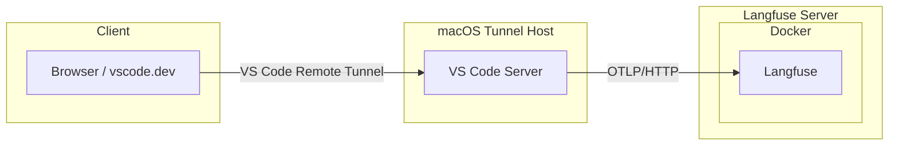

# VS Code Remote Tunnel Setup

English | [日本語](vscode-remote-tunnel.md)

This guide explains how to connect to VS Code on a Mac from a browser on a separate host using VS Code Remote Tunnel.


```mermaid
flowchart LR
  subgraph MBA[Client]
    A[Browser / vscode.dev]
  end
  subgraph MINI[macOS Tunnel Host]
    C[VS Code Server]
  end
  subgraph LF[Langfuse Server]
    subgraph DOCKER[Docker]
      D[Langfuse]
    end
  end
  A -->|VS Code Remote Tunnel| C
  C -->|OTLP/HTTP| D
```

The sender of OpenTelemetry is not the browser, but the VS Code Server running on the remote host connected via Remote Tunnel.
Therefore, the configuration that enables connecting to the Langfuse endpoint is performed on the remote host.

## 1. Prerequisites

Assumes that the shared authentication environment file described in "Direct OpenTelemetry Ingestion" in the README has already been created on the remote host:

```text
~/.config/langfuse/copilot-otel.env
```

Install VS Code on the remote Mac and make its `code` command available in your terminal. The script in section 2 installs the Tunnel service and creates the plist and LaunchAgents symlink. In the shared env file, choose `true` or `false` for both capture variables before continuing.

For more details on VS Code Remote Tunnel, see the [official VS Code documentation](https://code.visualstudio.com/docs/remote/tunnels).

## 2. Install and Configure the Tunnel Service

`code tunnel service` runs under macOS `launchd`. `launchd` does not read environment variables from the terminal that installed the service or from `~/.zshrc`.

Therefore, the following settings are not reflected through the `code()` wrapper in `~/.zshrc` alone:

- `OTEL_EXPORTER_OTLP_ENDPOINT`
- `OTEL_EXPORTER_OTLP_PROTOCOL`
- `OTEL_EXPORTER_OTLP_HEADERS`
- `OTEL_RESOURCE_ATTRIBUTES`
- `OTEL_INSTRUMENTATION_GENAI_CAPTURE_MESSAGE_CONTENT`
- `COPILOT_OTEL_ENDPOINT`
- `COPILOT_OTEL_ENABLED`
- `COPILOT_OTEL_CAPTURE_CONTENT`

Run the following on the remote Mac as the logged-in user. Choose `TUNNEL_NAME` at the top. The script reads the shared env file, installs the service if its plist is absent (authentication may be required), writes the OTel values, validates the plist, creates the LaunchAgents symlink, and loads the service. Remote OTel User Settings are not needed: the plist process environment configures both hosts.

```bash
(
set -eu
umask 077

TUNNEL_NAME="macmini"
ENV_FILE="$HOME/.config/langfuse/copilot-otel.env"

# Use the original plist generated by VS Code.
PLIST="$HOME/com.visualstudio.code.tunnel.plist"
LAUNCH_AGENT="$HOME/Library/LaunchAgents/com.visualstudio.code.tunnel.plist"

if [[ ! -r "$ENV_FILE" ]]; then
  echo "Environment file not found: $ENV_FILE" >&2
  exit 1
fi

unset LANGFUSE_BASE_URL OTEL_EXPORTER_OTLP_HEADERS \
  COPILOT_OTEL_CAPTURE_CONTENT OTEL_INSTRUMENTATION_GENAI_CAPTURE_MESSAGE_CONTENT
source "$ENV_FILE"
: "${LANGFUSE_BASE_URL:?}"
: "${OTEL_EXPORTER_OTLP_HEADERS:?}"
LANGFUSE_BASE_URL="${LANGFUSE_BASE_URL%/}"
for capture_value in "$COPILOT_OTEL_CAPTURE_CONTENT" "$OTEL_INSTRUMENTATION_GENAI_CAPTURE_MESSAGE_CONTENT"; do
  case "$capture_value" in
    true|false) ;;
    *) echo "Capture settings must be true or false" >&2; exit 1 ;;
  esac
done

OTEL_RESOURCE_ATTRIBUTES_VALUE="langfuse.trace.metadata.execution_origin=vscode-chat"

# Do not overwrite an existing regular file in LaunchAgents.
mkdir -p "$(dirname "$LAUNCH_AGENT")"
if [[ -e "$LAUNCH_AGENT" && ! -L "$LAUNCH_AGENT" ]]; then
  echo "Review and move the existing file first: $LAUNCH_AGENT" >&2
  exit 1
fi
if [[ ! -f "$PLIST" ]]; then
  command code tunnel service install --name "$TUNNEL_NAME"
fi
if [[ ! -r "$PLIST" ]]; then
  echo "Tunnel service plist not found: $PLIST" >&2
  exit 1
fi
LABEL="$(/usr/libexec/PlistBuddy -c 'Print :Label' "$PLIST")"
chmod 600 "$PLIST"
DOMAIN="gui/$(id -u)"

if ! /usr/libexec/PlistBuddy -c 'Print :EnvironmentVariables' "$PLIST" >/dev/null 2>&1; then
  /usr/libexec/PlistBuddy -c 'Add :EnvironmentVariables dict' "$PLIST"
fi

set_plist_env() {
  local key="$1"
  local value="$2"
  plutil -remove "EnvironmentVariables.${key}" "$PLIST" 2>/dev/null || true
  plutil -insert "EnvironmentVariables.${key}" -string "$value" "$PLIST"
}

set_plist_env COPILOT_OTEL_ENDPOINT "${LANGFUSE_BASE_URL}/api/public/otel"
set_plist_env OTEL_EXPORTER_OTLP_ENDPOINT "${LANGFUSE_BASE_URL}/api/public/otel/v1/traces"
set_plist_env OTEL_EXPORTER_OTLP_PROTOCOL "http/json"
set_plist_env OTEL_EXPORTER_OTLP_HEADERS "$OTEL_EXPORTER_OTLP_HEADERS"
set_plist_env OTEL_RESOURCE_ATTRIBUTES "$OTEL_RESOURCE_ATTRIBUTES_VALUE"
set_plist_env OTEL_INSTRUMENTATION_GENAI_CAPTURE_MESSAGE_CONTENT "$OTEL_INSTRUMENTATION_GENAI_CAPTURE_MESSAGE_CONTENT"
set_plist_env COPILOT_OTEL_ENABLED "true"
set_plist_env COPILOT_OTEL_CAPTURE_CONTENT "$COPILOT_OTEL_CAPTURE_CONTENT"

chmod 600 "$PLIST"
plutil -lint "$PLIST"

if [[ ! -L "$LAUNCH_AGENT" ]] || [[ "$(readlink "$LAUNCH_AGENT")" != "$PLIST" ]]; then
  ln -sfn "$PLIST" "$LAUNCH_AGENT"
fi
if launchctl print "$DOMAIN/$LABEL" >/dev/null 2>&1; then
  launchctl bootout "$DOMAIN/$LABEL"
fi
launchctl bootstrap "$DOMAIN" "$PLIST"
launchctl kickstart "$DOMAIN/$LABEL"
)
```

This example applies when VS Code generates `$HOME/com.visualstudio.code.tunnel.plist` on macOS. Keep it as the source of truth and expose it through a symlink in `~/Library/LaunchAgents` so macOS loads the service after login. If a regular file already exists at the link destination, inspect and move it before running the example. If your distribution uses a different location, use its actual plist path; do not create a second service definition.

To apply changes to the shared env file, run this script again. The subshell confines sourced credentials to the setup step. Reloading temporarily disconnects an active Tunnel.

| Process | Environment variable | Endpoint |
| --- | --- | --- |
| Extension Host | `COPILOT_OTEL_ENDPOINT` | `/api/public/otel` (appends `/v1/traces`) |
| Agent Host | `OTEL_EXPORTER_OTLP_ENDPOINT` | `/api/public/otel/v1/traces` (used as-is) |

> [!TIP]
> `COPILOT_OTEL_CAPTURE_CONTENT` controls content transmission for the Extension Host, while `OTEL_INSTRUMENTATION_GENAI_CAPTURE_MESSAGE_CONTENT` controls it for the Agent Host. The latter is also used by Copilot CLI/TUI.

> [!WARNING]
> Setting either value to `true` may transmit and persist sensitive message content such as prompts, responses, and tool arguments from the corresponding pipeline. We recommend setting both to `false`.

> [!CAUTION]
> The plist contains Langfuse Basic authentication credentials. Do not paste the contents of your plist into public repositories, issues, or logs.

## 3. Verify Connection and Authentication

Verify that the Langfuse endpoint is reachable from the host running Remote Tunnel:

```bash
curl -i "http://192.168.1.20:16300"
```

If you receive a response from Langfuse Web, network connectivity is confirmed.

Open `https://vscode.dev/tunnel/`, sign in with the account used to install the Tunnel, and select your configured Tunnel name. Sign in to Copilot in VS Code Chat and send a test message.

## 4. Verification

Check the following:

1. VS Code Chat returns a response to messages.
2. A Trace is created in the Langfuse Web UI.
3. The Trace metadata contains:

```text
langfuse.trace.metadata.execution_origin=vscode-chat
```

Confirm that the endpoint and capture value in the VS Code logs match your choices. For example, with Extension Host capture set to `false`:

```text
[OTel] Instrumentation enabled
exporter=otlp-http
endpoint=http://192.168.1.20:16300/api/public/otel
captureContent=false
```

After restarting macOS and logging in, confirm that the Tunnel reconnects automatically and a Copilot Chat message still produces a Trace in Langfuse.

## 5. Differences from CLI/TUI

| Access Method   | Execution Location                   | Configuration Method               | `execution_origin` |
| --------------- | ------------------------------------ | ---------------------------------- | ------------------ |
| Copilot CLI/TUI | Integrated Terminal                  | `copilot()` wrapper in `~/.zshrc`  | `manual-tui`       |
| VS Code Chat    | VS Code Server on Remote Tunnel Host | launchd plist process env | `vscode-chat`      |

When using VS Code Chat via Remote Tunnel, shell settings on the browser side and `~/.zshrc` on the browser host are not propagated to the remote VS Code Server.

Additionally, GitHub authentication for VS Code Chat and Copilot CLI authentication in the terminal use separate pathways. Being signed in on one does not automatically activate the other.

## 6. Security Considerations

In this setup, transmissions from VS Code Server to Langfuse use plain HTTP. When accessing from outside the LAN, use HTTPS, a VPN, or a TLS-terminating reverse proxy.

Set `COPILOT_OTEL_CAPTURE_CONTENT=false` for the Extension Host and `OTEL_INSTRUMENTATION_GENAI_CAPTURE_MESSAGE_CONTENT=false` for the Agent Host to avoid transmitting prompts, responses, and tool arguments from either pipeline.

OTLP authentication headers can be inherited by subprocesses launched from the Agent Host. Do not print the full process environment to logs.
