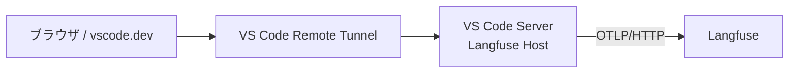

# VS Code Remote Tunnel 経由の設定

VS Code Remote Tunnel を利用して、別ホストのブラウザから Mac の VS Code に接続する場合の設定です。



OpenTelemetry の送信元はブラウザではなく、Remote Tunnel 接続先で動作する VS Code Server です。
そのため、Langfuse のエンドポイントへ接続できるようにする設定は、接続先ホスト側で行います。

## 1. 前提

README の「OpenTelemetry 直接送信」にある共通認証環境ファイルを、接続先ホスト上に作成済みであることを前提にします。

```text
~/.config/langfuse/copilot-otel.env
```

Remote Tunnel 自体は、次のコマンドでサービスとしてインストール済みとします。

```bash
code tunnel service install --name macmini
```

VS Code Remote Tunnel の詳細は、[VS Code公式ドキュメント](https://code.visualstudio.com/docs/remote/tunnels)を参照してください。

## 2. トンネルサービスへOpenTelemetry環境変数を設定

`code tunnel service` は macOS の `launchd` で起動します。`launchd` は、サービスをインストールしたターミナルの環境変数や `~/.zshrc` を読み込みません。

そのため、次の設定は `~/.zshrc` の `code()` ラッパーだけでは反映されません。

- `OTEL_EXPORTER_OTLP_ENDPOINT`
- `OTEL_EXPORTER_OTLP_PROTOCOL`
- `OTEL_EXPORTER_OTLP_HEADERS`
- `OTEL_RESOURCE_ATTRIBUTES`
- `COPILOT_OTEL_ENABLED`
- `COPILOT_OTEL_CAPTURE_CONTENT`

サービスが使用するplistへ環境変数を設定します。以下は、既存の共通認証環境ファイルから値を読み込み、VS Code Tunnelのサービスplistへ反映する例です。

```bash
set -eu

ENV_FILE="$HOME/.config/langfuse/copilot-otel.env"
PLIST="$HOME/com.visualstudio.code.tunnel.plist"
LABEL="com.visualstudio.code.tunnel"

if [[ ! -r "$ENV_FILE" ]]; then
  echo "環境ファイルが見つかりません: $ENV_FILE" >&2
  exit 1
fi

if [[ ! -r "$PLIST" ]]; then
  echo "Tunnelサービスのplistが見つかりません: $PLIST" >&2
  echo "先に code tunnel service install --name macmini を実行してください。" >&2
  exit 1
fi

source "$ENV_FILE"

OTEL_RESOURCE_ATTRIBUTES_VALUE="langfuse.trace.metadata.execution_origin=vscode-chat"

launchctl unload "$PLIST" 2>/dev/null || true

if ! /usr/libexec/PlistBuddy -c 'Print :EnvironmentVariables' "$PLIST" >/dev/null 2>&1; then
  /usr/libexec/PlistBuddy -c 'Add :EnvironmentVariables dict' "$PLIST"
fi

set_plist_env() {
  local key="$1"
  local value="$2"
  plutil -remove "EnvironmentVariables.${key}" "$PLIST" 2>/dev/null || true
  plutil -insert "EnvironmentVariables.${key}" -string "$value" "$PLIST"
}

set_plist_env OTEL_EXPORTER_OTLP_ENDPOINT "$OTEL_EXPORTER_OTLP_ENDPOINT"
set_plist_env OTEL_EXPORTER_OTLP_PROTOCOL "$OTEL_EXPORTER_OTLP_PROTOCOL"
set_plist_env OTEL_EXPORTER_OTLP_HEADERS "$OTEL_EXPORTER_OTLP_HEADERS"
set_plist_env OTEL_RESOURCE_ATTRIBUTES "$OTEL_RESOURCE_ATTRIBUTES_VALUE"
set_plist_env COPILOT_OTEL_ENABLED "true"
set_plist_env COPILOT_OTEL_CAPTURE_CONTENT "false"

chmod 600 "$PLIST"
plutil -lint "$PLIST"

launchctl load "$PLIST"
launchctl start "$LABEL"
```

VS Codeの配布形態によってサービスラベルが異なる場合は、次で確認できます。

```bash
launchctl list | grep 'com.visualstudio.*tunnel'
```

`code tunnel service install` を再実行するとplistが再生成される場合があります。その場合は、上記の環境変数設定も再実行してください。

> [!CAUTION]
> plistにはLangfuseのBasic認証情報が保存されます。plistの内容を公開リポジトリ、Issue、ログへ貼り付けないでください。

## 3. VS Code Chat側の設定

Remote Tunnelへ接続した状態で、コマンドパレットから **Preferences: Open User Settings (JSON)** を開き、次を追加します。

```json
{
  "github.copilot.chat.otel.enabled": true,
  "github.copilot.chat.otel.exporterType": "otlp-http",
  "github.copilot.chat.otel.otlpEndpoint": "http://192.168.1.20:16300/api/public/otel",
  "github.copilot.chat.otel.captureContent": false
}
```

`192.168.1.20:16300` は、LangfuseホストのIPアドレスと公開ポートへ置き換えてください。

これらはVS Code Chatの設定であり、`.zshrc`や統合ターミナルの環境変数だけでは設定できません。Workspace Settingsではなく、User Settings JSONへ追加してください。

## 4. 接続先と認証の確認

Remote Tunnelの接続先ホスト上で、Langfuseのエンドポイントへ到達できることを確認します。

```bash
curl -i "http://192.168.1.20:16300"
```

Langfuse Webの応答が返れば、ネットワーク経路は確認できています。

その後、VS Code ChatでCopilotへログインし、テストメッセージを送信します。認証状態が不安定な場合は、VS CodeのアカウントメニューからGitHubアカウントを一度サインアウトしてから、再度サインインしてください。

## 5. 動作確認

次を確認します。

1. VS Code Chatでメッセージに応答が返る
2. Langfuse Web UIにTraceが作成される
3. Traceのmetadataに次が含まれる

```text
langfuse.trace.metadata.execution_origin=vscode-chat
```

VS Codeのログに、次のようなOpenTelemetry設定が出力されることも確認できます。

```text
[OTel] Instrumentation enabled
exporter=otlp-http
endpoint=http://192.168.1.20:16300/api/public/otel
captureContent=false
```

## 6. CLI/TUIとの違い

| 利用経路 | 実行場所 | 設定方法 | `execution_origin` |
| --- | --- | --- | --- |
| Copilot CLI/TUI | 統合ターミナル | `~/.zshrc` の `copilot()` ラッパー | `manual-tui` |
| VS Code Chat | Remote Tunnel接続先のVS Code Server | User Settings JSON + launchd plist | `vscode-chat` |

Remote Tunnel経由のVS Code Chatでは、ブラウザ側のシェル設定や、ブラウザを開いたホストの `~/.zshrc` は接続先のVS Code Serverへ伝搬しません。

また、VS Code ChatのGitHub認証と、ターミナルで実行するCopilot CLIの認証は別経路です。片方のサインイン状態だけで、もう片方が自動的に有効になるとは限りません。

## 7. セキュリティ上の注意

この構成では、VS Code ServerからLangfuseへHTTPで送信します。LAN外から利用する場合は、HTTPS、VPN、またはTLS終端するリバースプロキシを使用してください。

`captureContent` および `COPILOT_OTEL_CAPTURE_CONTENT` は `false` に設定し、プロンプト、応答、ツール引数などの本文を送信しない構成を推奨します。
