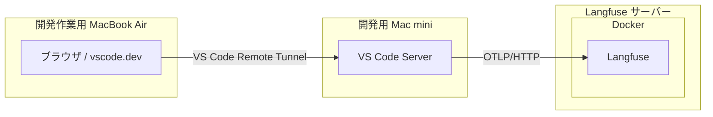
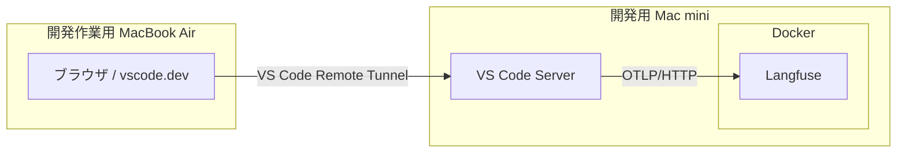

# VS Code Remote Tunnel 経由の設定

[English](vscode-remote-tunnel.en.md) | 日本語

VS Code Remote Tunnel を利用して、別ホストのブラウザから Mac の VS Code に接続する場合の設定です。



OpenTelemetry の送信元はブラウザではなく、Remote Tunnel 接続先で動作する VS Code Server です。
そのため、Langfuse のエンドポイントへ接続できるようにする設定は、接続先ホスト側で行います。

私の検証環境は VS Code Server と Langfuse サーバーが同じ Mac mini に同居しているので、実態は以下のような構成になっています。



## 1. 前提

README の「OpenTelemetry 直接送信」にある共通認証環境ファイルを、接続先ホスト上に作成済みであることを前提にします。

```text
~/.config/langfuse/copilot-otel.env
```

Remote Tunnel 自体は、次のコマンドでサービスとしてインストール済みとします。

```bash
code tunnel service install --name macmini
```

VS Code Remote Tunnel の詳細は、[VS Code 公式ドキュメント](https://code.visualstudio.com/docs/remote/tunnels) を参照してください。

## 2. トンネルサービスへ OpenTelemetry 環境変数を設定

`code tunnel service` は macOS の `launchd` で起動します。`launchd` は、サービスをインストールしたターミナルの環境変数や `~/.zshrc` を読み込みません。

そのため、次の設定は `~/.zshrc` の `code()` ラッパーだけでは反映されません。

- `OTEL_EXPORTER_OTLP_ENDPOINT`
- `OTEL_EXPORTER_OTLP_PROTOCOL`
- `OTEL_EXPORTER_OTLP_HEADERS`
- `OTEL_RESOURCE_ATTRIBUTES`
- `OTEL_INSTRUMENTATION_GENAI_CAPTURE_MESSAGE_CONTENT`
- `COPILOT_OTEL_ENABLED`
- `COPILOT_OTEL_CAPTURE_CONTENT`

サービスが使用する plist へ環境変数を設定します。以下は、既存の共通認証環境ファイルから値を読み込み、VS Code Tunnel のサービス plist へ反映する例です。

```bash
set -eu

ENV_FILE="$HOME/.config/langfuse/copilot-otel.env"

# 先に `find` で実際のplistのパスを確認し、その値に置き換えます。
PLIST="/path/to/your/tunnel.plist"

if [[ ! -r "$ENV_FILE" ]]; then
  echo "環境ファイルが見つかりません: $ENV_FILE" >&2
  exit 1
fi

if [[ ! -r "$PLIST" ]]; then
  echo "Tunnelサービスのplistが見つかりません: $PLIST" >&2
  echo "先に次のコマンドでplistのパスを確認してください。" >&2
  echo 'find "$HOME" "$HOME/Library/LaunchAgents" -maxdepth 1 -type f -name "*.tunnel.plist" -print' >&2
  exit 1
fi

source "$ENV_FILE"

OTEL_RESOURCE_ATTRIBUTES_VALUE="langfuse.trace.metadata.execution_origin=vscode-chat"
: "${OTEL_INSTRUMENTATION_GENAI_CAPTURE_MESSAGE_CONTENT:=false}"
LABEL="$(/usr/libexec/PlistBuddy -c 'Print :Label' "$PLIST")"

launchctl unload "$PLIST" 2>/dev/null || true

if ! /usr/libexec/PlistBuddy -c 'Print :EnvironmentVariables' "$PLIST" >/dev/null 2>&1; then
  /usr/libexec/PlistBuddy -c 'Add :EnvironmentVariables dict' "$PLIST"
fi

set_plist_env() {
  local key="$1"
  local value="$2"
  plutil -remove "EnvironmentVariables.${key}" "$PLIST" 2>/dev/null || true
  plutil -insert "EnvironmentVariables.${key}" -string "$value" "$PLIST"
}

set_plist_env OTEL_EXPORTER_OTLP_ENDPOINT "$OTEL_EXPORTER_OTLP_ENDPOINT"
set_plist_env OTEL_EXPORTER_OTLP_PROTOCOL "$OTEL_EXPORTER_OTLP_PROTOCOL"
set_plist_env OTEL_EXPORTER_OTLP_HEADERS "$OTEL_EXPORTER_OTLP_HEADERS"
set_plist_env OTEL_RESOURCE_ATTRIBUTES "$OTEL_RESOURCE_ATTRIBUTES_VALUE"
set_plist_env OTEL_INSTRUMENTATION_GENAI_CAPTURE_MESSAGE_CONTENT "$OTEL_INSTRUMENTATION_GENAI_CAPTURE_MESSAGE_CONTENT"
set_plist_env COPILOT_OTEL_ENABLED "true"
set_plist_env COPILOT_OTEL_CAPTURE_CONTENT "false"

chmod 600 "$PLIST"
plutil -lint "$PLIST"

launchctl load "$PLIST"
launchctl start "$LABEL"
```

VS Code の配布形態によって plist の場所やサービスラベルが異なります。plist の場所は次で確認できます。

```bash
find "$HOME" "$HOME/Library/LaunchAgents" -maxdepth 1 -type f -name "*.tunnel.plist" -print
```

サービスラベルは plist から確認できます。

```bash
/usr/libexec/PlistBuddy -c 'Print :Label' "/path/to/your/tunnel.plist"
```

`code tunnel service install` を再実行すると plist が再生成される場合があります。その場合は、上記の環境変数設定も再実行してください。

> [!TIP]
> `OTEL_INSTRUMENTATION_GENAI_CAPTURE_MESSAGE_CONTENT` (Copilot CLI/TUI) と `COPILOT_OTEL_CAPTURE_CONTENT` (VS Code Copilot Chat) は、プロンプト、応答、ツール引数などの本文を送信するかどうかの設定です。

> [!WARNING]
> `OTEL_INSTRUMENTATION_GENAI_CAPTURE_MESSAGE_CONTENT` と `COPILOT_OTEL_CAPTURE_CONTENT` を `true` にすると、それぞれ Copilot CLI/TUI と VS Code Copilot Chat において、センシティブな情報が永続化されてしまい Langfuse 上で権限のあるユーザーに覗き見られてしまう可能性があります。特に共有環境などでは `false` を設定することを推奨します。

> [!CAUTION]
> plist には Langfuse の Basic 認証情報が保存されます。plist の内容を公開リポジトリ、Issue、ログへ貼り付けないでください。

## 3. VS Code Chat 側の設定

Remote Tunnel へ接続した状態で、コマンドパレットから **Preferences: Open User Settings (JSON)** を開き、次を追加します。

```json
{
  "github.copilot.chat.otel.enabled": true,
  "github.copilot.chat.otel.exporterType": "otlp-http",
  "github.copilot.chat.otel.otlpEndpoint": "http://192.168.1.20:16300/api/public/otel",
  "github.copilot.chat.otel.captureContent": false
}
```

`192.168.1.20:16300` は、Langfuse ホストの IP アドレスと公開ポートへ置き換えてください。

これらは VS Code Chat の設定であり、`.zshrc` や統合ターミナルの環境変数だけでは設定できません。Workspace Settings ではなく、User Settings JSON へ追加してください。

> [!TIP]
> `github.copilot.chat.otel.captureContent` は、プロンプト、応答、ツール引数などの本文を送信するかどうかの設定です。

> [!WARNING]
> `github.copilot.chat.otel.captureContent` を `true` にすると、センシティブな情報が永続化されてしまい Langfuse 上で権限のあるユーザーに覗き見られてしまう可能性があります。特に共有環境などでは `false` を設定することを推奨します。

## 4. 接続先と認証の確認

Remote Tunnel の接続先ホスト上で、Langfuse のエンドポイントへ到達できることを確認します。

```bash
curl -i "http://192.168.1.20:16300"
```

Langfuse Web の応答が返れば、ネットワーク経路は確認できています。

その後、VS Code Chat で Copilot へログインし、テストメッセージを送信します。認証状態が不安定な場合は、VS Code のアカウントメニューから GitHub アカウントを一度サインアウトしてから、再度サインインしてください。

## 5. 動作確認

次を確認します。

1. VS Code Chat でメッセージに応答が返る
2. Langfuse Web UI に Trace が作成される
3. Trace の metadata に次が含まれる

```text
langfuse.trace.metadata.execution_origin=vscode-chat
```

VS Code のログに、次のような OpenTelemetry 設定が出力されることも確認できます。

```text
[OTel] Instrumentation enabled
exporter=otlp-http
endpoint=http://192.168.1.20:16300/api/public/otel
captureContent=false
```

## 6. CLI/TUI との違い

| 利用経路        | 実行場所                              | 設定方法                           | `execution_origin` |
| --------------- | ------------------------------------- | ---------------------------------- | ------------------ |
| Copilot CLI/TUI | 統合ターミナル                        | `~/.zshrc` の `copilot()` ラッパー | `manual-tui`       |
| VS Code Chat    | Remote Tunnel 接続先の VS Code Server | User Settings JSON + launchd plist | `vscode-chat`      |

Remote Tunnel 経由の VS Code Chat では、ブラウザ側のシェル設定や、ブラウザを開いたホストの `~/.zshrc` は接続先の VS Code Server へ伝搬しません。

また、VS Code Chat の GitHub 認証と、ターミナルで実行する Copilot CLI の認証は別経路です。片方のサインイン状態だけで、もう片方が自動的に有効になるとは限りません。

## 7. セキュリティ上の注意

この構成では、VS Code Server から Langfuse へ HTTP で送信します。LAN 外から利用する場合は、HTTPS、VPN、または TLS 終端するリバースプロキシを使用してください。

`captureContent` および `COPILOT_OTEL_CAPTURE_CONTENT` は `false` に設定し、プロンプト、応答、ツール引数などの本文を送信しない構成を推奨します。
